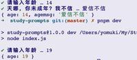

<!--
 * @Desc: 
 * @Author: 曾茹菁
 * @Date: 2022-08-15 09:31:06
 * @LastEditors: 曾茹菁
 * @LastEditTime: 2022-08-15 13:09:19
-->
# prompts 记录
[prompts](https://www.npmjs.com/package/prompts) 是一个cli交互页面插件
## 基础使用
```js
import prompts from "prompts";

const questions = [
  {
    type: "number", //输入参数类型 
    name: "value",// 在返回结果中的键名
    message: "How old are you?",// 询问信息
    validate: (value) => (value < 18 ? `Nightclub is 18+ only` : true),// 输入值验证
  },
];
async function init() {
  const res = await prompts(questions);
  console.log(res);
}

init().catch((err) => {
  console.error(err);
});
```
### message
询问语句
- String | Function  
- **必填**
关于接受的Function：
- 会在提示用户之前立即调用
- 下面字段的Function同此处相同
- 函数签名是(prev, values, prompt)
  - prev是来自上一个提示的值
  - values是迄今为止收集的所有值的响应对象
  - prompt是上一个提示对象
```js
const questions = [
  {
    type: "number",
    name: "age",
    message: "请输入年龄",
  },
  {
    type: "text",
    name: "agemsg",
    message: (prev, values, prompt) => {
      console.log(prev, values, prompt);
      // 19 { age: 19 } { type: 'number', name: 'age', message: '请输入年龄' }
      return "hi";
    },
  },
];
```
### name
作为返回结果的键名
- String | Function 
- **必填** 不填就是undefined
- 如果有name重复，后面的覆盖前面的
### initial
默认值/初始值
- String|Function
### format
格式化
- Function
- 函数签名是(val, values)，其中val是当前提示中的值， values是当前响应对象
### onRender
提示时的渲染回调
- Function
- 函数内的this是当前的提示对象，所以不要用箭头函数
- 函数的接收参数为[kleur](https://github.com/lukeed/kleur) 【ANSI 颜色格式化终端文本】
```js
const questions = [
  {
    type: "number",
    name: "age",
    message: "请输入年龄",
    onRender(kleur) {
      console.log(this); // NumberPrompt
      this.msg = kleur.red("Enter a number"); // Enter a number变成红色啦~
    },
  },
];
```
kleur 可以使用链式操作
```js
const { bold, red, underline } = kleur;
this.msg = red().underline().bold("Enter a number");
```
变成了带下划线的红色
### onState
当前提示的状态发生变化时的回调
- Function
- 函数入参是(state)
```js
const questions = [
  {
    type: "number",
    name: "age",
    message: "请输入年龄",
    onState: (state) => {
      console.log(state);
      // { value: 1, aborted: false, exited: false }
    },
  },
];
```
### type
输入参数类型，无法键入指定类型以外的类型
- String | Function 
- **必填** [类型有效值](https://www.npmjs.com/package/prompts#-types)
  - text,password,invisible,number,confirm,list,toggle,select,multiselect,autocompleteMultiselect,autocomplete,date
- 不设置type 或 将type 设为null时，会跳过这个询问。
- 设置为错误的类型时，会ERROR
```js
const questions2 = [
  {
    name: "value",
    message: "这次没有设置type",
  },
  {
    type: null,
    name: "value",
    message: "这次设置null",
  },
  {
    type: "youshuaigema",
    name: "value",
    message: "这次设置个错误的类型",
  },
];
// Error: prompt type (youshuaigema) is not defined
```
使用Function
```js
const questions = [
  {
    type: "number",
    name: "age",
    message: "请输入年龄",
  },
  {
    type: (prev) => (prev < 18 ? "text" : null),
    name: "agemsg",
    message: "天哪，你未成年？我不信",
  },
];
```

#### type=number
- 可设max 和 min
```js
{
  type: 'number',
  name: 'value',
  message: 'How old are you?',
  initial: 0,
  style: 'default',
  min: 2,
  max: 10
}
```
#### type=confirm
- 可设initial为true，这样直接回车就是true啦
- 不设的时候直接回车就是false
```js
const questions = [
  {
    type: "confirm",
    name: "isLove",
    message: "弥央是不是我老婆？",
    initial: true,
  },
];
```
#### type=toggle
- active 状态。默认on
- inactive 状态。默认off
- initial 默认false
```js
const questions = [
  {
    type: "toggle",
    name: "isLove",
    message: "弥央是不是我老婆？",
    initial: true,
    active: "当然是啦！",
    inactive: "做梦呢你！",
  },
];
// 弥央是不是我老婆？ … 做梦呢你！ / 当然是啦！
// { isLove: true }
```
#### type=list
- separator 字符串分隔符，默认为','。
```js
const questions = [
  {
    type: "list",
    name: "dreams",
    message: "请说出你的梦想！",
    separator: ",",
  },
];
// ✔ 请说出你的梦想！ … 打游戏,打游戏,打游戏
// { dreams: [ '打游戏', '打游戏', '打游戏' ] }
```
#### type=select
单选
- choices 选项列
- initial 默认索引
```js
const questions = [
  {
    type: "select",
    name: "haopengyou",
    message: "请选择你的伙伴！",
    choices: [
      { title: "弥央", description: "这是一段对弥央的说明", value: "miyo" },
      { title: "诺亚", value: "ny", disabled: true },
      { title: "艾拉法拉", value: "alfal" },
    ],
    initial: 1,
  },
];
// ✔ 请选择你的伙伴！ › 艾拉法拉
// { haopengyou: 'alfal' }
```
#### type=multiselect
多选
- choices 选项列
- max 最多可选
- min 最少可选
- hint 操作提示
- optionsPerPage 每页选项数量
```js
const questions = [
  {
    type: "multiselect",
    name: "haopengyou",
    message: "请选择你的伙伴！",
    choices: [
      { title: "弥央", description: "这是一段对弥央的说明", value: "miyo" },
      { title: "诺亚", value: "ny", disabled: true },
      { title: "艾拉法拉", value: "alfal" },
    ],
    max: 2,
    hint: "- Space to select. Return to submit",
  },
];
// ? 请选择你的伙伴！ › - Space to select. Return to submit 
// Instructions:
//     ↑/↓: Highlight option
//     ←/→/[space]: Toggle selection
//     enter/return: Complete answer
// ◯   弥央 - 这是一段对弥央的说明
// ◯   诺亚
// ◯   艾拉法拉
// ✔ 请选择你的伙伴！ › 弥央, 艾拉法拉
// { haopengyou: [ 'miyo', 'alfal' ] }
```

